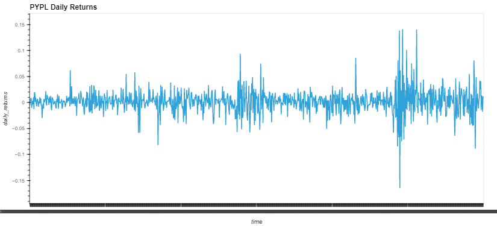
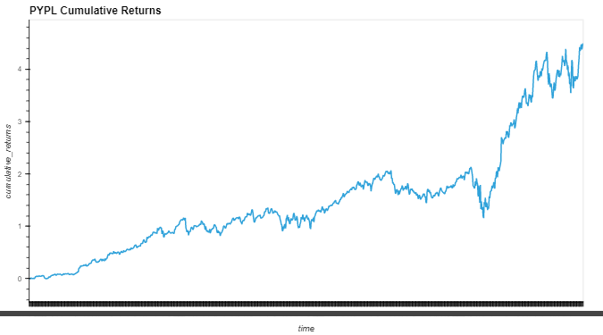
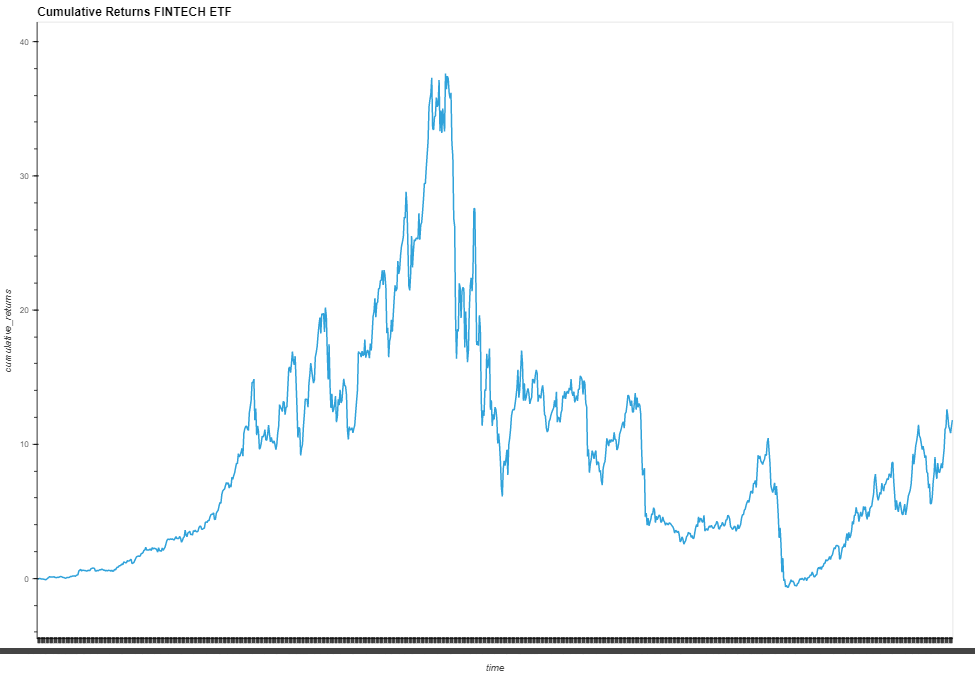
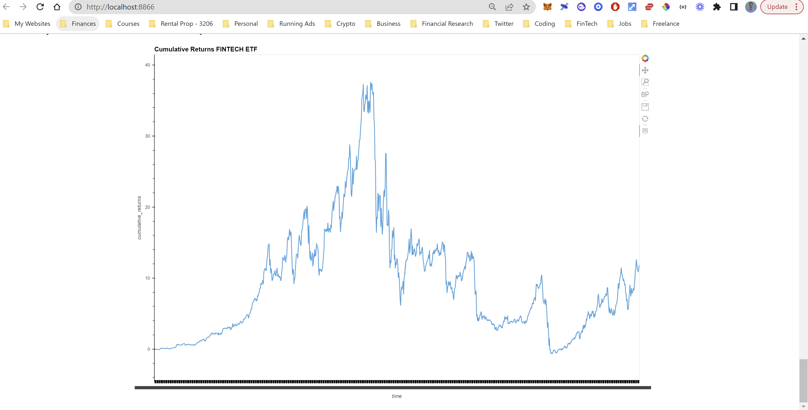

# ETF_Analysis
This is a financial database and web application analyzing the performance of a hypothetical fintech ETF.

---

## Technologies

This project leverages python 3.7 with the following packages:

* [pandas] (https://github.com/pandas-dev/pandas) - For data manipulation and analysis.

* [hvplot] (https://github.com/holoviz/hvplot) - For high-level plotting.

* [numpy] (https://github.com/numpy/numpy) - For importing cvs files using standarized file path notation.

* [sqlalchemy] (https://github.com/sqlalchemy/sqlalchemy) - An SQL toolkit for python allowing for full power and flexibility of SQL.
---

## Datasets

Dataset pulled from ETF_Analysis folder which contains db file.

## Usage

### General

Upon launching the etf_analyzer.ipynb run each cell sequentially, ensuring to import the required libraries.

### Plot Daily and Cumulative Returns of PYPL

Your graphs should look like these.

### Plot Cumulative Return of Fintech ETF

Your graph should look like this.

### Delopy Notebook as a Web Application using Voila

Navigate your git bash or terminal to the ETF_Anlysis_Folder and then type:

voila etf_analyzer.ipynb

This will launch a web application showing all the interactive plots.

